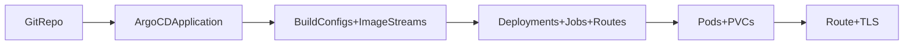

# MediaCMS OpenShift Deployment (ArgoCD, OpenShift 4.19)

Concise guide for deploying MediaCMS on OpenShift 4.19 using the GitOps manifests in `deploy/openshift/`, ArgoCD, and the in-cluster PostgreSQL/Redis components. Manual `oc apply` works as a fallback, but the flow below assumes ArgoCD.

## Prerequisites
- OpenShift 4.19 cluster with cluster-admin (or project admin) access and `oc` CLI logged in.
- ArgoCD installed (e.g., namespace `openshift-gitops`) and permission to create an Application.
- Git access to this repo/branch; default Application tracks `main` (`deploy/openshift/base`) and the dev overlay tracks `deploy/openshift-4.19`.
- Working storage class; prefer ReadWriteMany for media. Defaults: `storage/media-pvc.yaml` 100Gi, `storage/db-pvc.yaml` 20Gi.
- Internet egress for BuildConfigs (downloads ffmpeg/Bento4 in `Dockerfile.openshift`).
- Frontend static assets pre-built and committed to `static/` before building images.
- DNS/TLS ready for the route hostname you will set.

## Repository Map (what gets applied)
- Base Application and config: `[deploy/openshift/base](deploy/openshift/base)`
- Env overlays: `[deploy/openshift/overlays/dev](deploy/openshift/overlays/dev)`, `[deploy/openshift/overlays/prod](deploy/openshift/overlays/prod)`
- Builds: `[deploy/openshift/builds](deploy/openshift/builds)` (BuildConfigs, ImageStreams)
- Workloads: `[deploy/openshift/components](deploy/openshift/components)` (web, uwsgi, celery*, migrations, db, redis)
- Storage & networking: `[deploy/openshift/storage](deploy/openshift/storage)`, `[deploy/openshift/networking](deploy/openshift/networking)`
- Runtime config: `[deploy/openshift/base/mediacms-config.yaml](deploy/openshift/base/mediacms-config.yaml)`, `[deploy/openshift/base/mediacms-secrets.yaml](deploy/openshift/base/mediacms-secrets.yaml)`



## Quickstart (ArgoCD GitOps, in-cluster DB/Redis)
1. Create the project/namespace (needed before secrets):
   ```bash
   oc apply -f deploy/openshift/base/namespace.yaml
   ```
2. Create secrets (do not commit secrets; label for ArgoCD):
   ```bash
   oc create secret generic mediacms-secrets \
     --from-literal=SECRET_KEY="$(python - <<'PY' ; from django.core.management.utils import get_random_secret_key; print(get_random_secret_key()); PY)" \
     --from-literal=DB_USER='mediacms' \
     --from-literal=DB_PASSWORD='<db-password>' \
     --from-literal=ADMIN_USER='admin' \
     --from-literal=ADMIN_EMAIL='admin@example.com' \
     --from-literal=ADMIN_PASSWORD='<admin-password>' \
     -n mediacms

   oc label secret mediacms-secrets \
     app.kubernetes.io/name=mediacms \
     app.kubernetes.io/part-of=mediacms \
     app.kubernetes.io/managed-by=argocd \
     -n mediacms
   ```
3. (Optional but recommended) Adjust non-sensitive config in `[deploy/openshift/base/mediacms-config.yaml](deploy/openshift/base/mediacms-config.yaml)` (e.g., `FRONTEND_HOST`, `PORTAL_NAME`, `DB_HOST`, `REDIS_HOST`, `REDIS_LOCATION`).
4. Apply the ArgoCD Application:
   - Production/default repo: `oc apply -k deploy/openshift/base/`
   - Dev/fork overlay: `oc apply -k deploy/openshift/overlays/dev/`
5. Watch ArgoCD/builds/pods:
   ```bash
   oc get application mediacms -n openshift-gitops
   oc get builds -n mediacms
   oc get pods -n mediacms
   ```
   ArgoCD creates BuildConfigs/ImageStreams, triggers image builds from `Dockerfile.openshift`, then deploys components (web, uwsgi, celery*, migrations job, db, redis, route, PVCs).
6. (Optional) Force an initial build if auto-trigger is delayed:
   ```bash
   oc start-build mediacms-base -n mediacms
   oc get builds -n mediacms -w
   ```

## Verification Checklist
- ArgoCD Application `mediacms` is `Synced`/`Healthy`: `oc get application mediacms -n openshift-gitops`
- Builds completed: `oc get builds -n mediacms` (look for `Complete`)
- Migrations job succeeded: `oc get jobs -n mediacms` and `oc logs job/migrations -n mediacms`
- Pods ready: web, uwsgi, celery-beat, celery-short, celery-long, db, redis show `1/1` (or replicas) ready.
- Route reachable: `oc get route web -n mediacms` then `curl -I https://<host>` (TLS edge by default).
- Admin login works with the admin credentials you set.

## Common Customizations
- **Repo/branch or new overlay:** Patch Application via an overlay (`overlays/dev` example) or create `overlays/<env>/kustomization.yaml` referencing `../../base`.
- **Scaling/resources:** Patch deployments under `overlays/prod/patches/` (e.g., replicas, uWSGI limits). Default sizes are set in `components/*.yaml`.
- **Storage:** Adjust PVC sizes/classes in `storage/media-pvc.yaml` and `storage/db-pvc.yaml`. Prefer RWX for media; with RWO, keep a single web+uwsgi replica or use shared storage.
- **Route/TLS:** Set `spec.host` and TLS policy in `networking/route.yaml` (or overlay patch). Edge termination with redirect is default.
- **External DB/Redis:** Point `DB_HOST`, `DB_PORT`, `DB_NAME` and `REDIS_LOCATION`/`REDIS_HOST` to external services in the ConfigMap; omit or patch out `components/db.yaml` and `components/redis.yaml` if you do not want in-cluster instances.
- **Frontend builds:** Ensure `static/` contains built assets before BuildConfig runs; otherwise extend BuildConfig or CI to build them.
- **Secrets:** Use `mediacms-secrets` template as a reference only; create real secrets out-of-band and keep ArgoCD labels so sync does not prune them.

## Recommendations, Warnings, Notes
- Do not commit real secrets; ArgoCD will prune unlabelled secrets/config—keep the labels shown above.
- Build pods need internet egress for ffmpeg/Bento4; restricted clusters require mirrors/offline artifacts.
- Migrations job runs as an ArgoCD PreSync hook; rerun manually with `oc create job --from=job/migrations migrations-manual -n mediacms` if needed.
- Prefer horizontal scaling (replicas/HPA) before increasing uWSGI threads; raising concurrency requires higher CPU/memory to avoid throttling/OOM.
- Large uploads rely on nginx `client_max_body_size` in `base/web-config.yaml`; align ingress/WAF limits accordingly.
- Media PVC ideally RWX; with RWO you must avoid concurrent writers or use a distributed file system (NFS, CephFS, etc.).
- ImageMagick policy comes from `base/imagemagick-policy.yaml` ConfigMap; the OpenShift image does not bake it.
- If using external DB/Redis, ensure network policies/firewall rules allow pod egress to those services.
