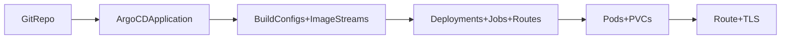

# MediaCMS OpenShift Deployment (ArgoCD, OpenShift 4.19)

Comprehensive guide for deploying MediaCMS on OpenShift 4.19 using the GitOps manifests in `deploy/openshift/`, ArgoCD, and the in-cluster PostgreSQL/Redis components. Manual `oc apply` works as a fallback, but the flow below assumes ArgoCD.

## Prerequisites

- OpenShift 4.19 cluster with cluster-admin (or project admin) access and `oc` CLI logged in.
- ArgoCD installed (e.g., namespace `openshift-gitops`) and permission to create an Application.
- Git access to this repo/branch; default Application tracks `main` (`deploy/openshift/base`) and the dev overlay tracks `deploy/openshift-4.19`.
- Working storage class; prefer ReadWriteMany for media and static files. Defaults: `storage/media-pvc.yaml` 100Gi, `storage/static-pvc.yaml` 5Gi, `storage/db-pvc.yaml` 20Gi.
- Internet egress for BuildConfigs (downloads ffmpeg/Bento4 in `Dockerfile.openshift`).
- Frontend static assets pre-built and committed to `static/` before building images.
- DNS/TLS ready for the route hostname you will set.

## Architecture

The deployment consists of:

- **Web Server**: Nginx reverse proxy (2+ replicas) serving static files and forwarding to uWSGI
- **uWSGI App**: Django application server (1+ replicas; scale based on CPU/RAM)
- **Celery Beat**: Scheduled tasks (1 replica, singleton)
- **Celery Short Workers**: Short-running tasks (2+ replicas)
- **Celery Long Workers**: Long-running video encoding tasks (2+ replicas)
- **Migrations Job**: One-time database migrations (runs before deployments)
- **PostgreSQL**: Application database (optional in-cluster `components/db.yaml`)
- **Redis**: Cache/broker (optional in-cluster `components/redis.yaml`)

## Directory Structure

```
deploy/openshift/
├── README.md                        # Detailed deployment documentation
├── app/                             # ArgoCD Application kustomizations (namespace: openshift-gitops)
│   ├── base/
│   │   ├── mediacms-application.yaml    # ArgoCD Application (main repo/branch)
│   │   └── kustomization.yaml       # Kustomize for ArgoCD Application
│   └── overlays/
│       └── dev/
│           └── kustomization.yaml   # ArgoCD Application overlay (fork repo/branch)
├── base/
│   ├── mediacms-config.yaml         # Non-sensitive configuration (ConfigMap)
│   ├── mediacms-secrets.yaml        # Secret template with required keys
│   ├── namespace.yaml               # Namespace definition
│   ├── imagemagick-policy.yaml      # ImageMagick policy ConfigMap
│   ├── uwsgi-config.yaml            # uWSGI configuration ConfigMap
│   ├── web-config.yaml              # Nginx configuration ConfigMap
│   ├── job-reader-role.yaml         # RBAC Role/Binding for migrations job
│   └── kustomization.yaml           # Kustomize base configuration (workloads)
├── overlays/
│   ├── dev/
│   │   ├── kustomization.yaml       # Dev overlay (fork repo, deploy/openshift-4.19 branch)
│   │   └── patches/
│   │       ├── namespace.yaml       # Sets namespace to mediacms-dev
│   │       ├── route.yaml           # Sets dev route hostname
│   │       ├── replicas.yaml        # Reduces replicas for dev
│   │       ├── resources.yaml       # Lowers resource limits
│   │       └── storage.yaml         # Smaller storage sizes
│   └── prod/
│       ├── kustomization.yaml       # Prod overlay (uses base defaults)
│       └── patches/
│           ├── namespace.yaml       # Sets namespace to mediacms-prod
│           ├── route.yaml           # Sets production route hostname
│           ├── replicas.yaml        # Increases replicas for prod
│           ├── resources.yaml       # Higher resource limits
│           ├── storage.yaml         # Larger storage sizes
│           └── storage-class.yaml   # Sets production storage class
├── builds/
│   ├── buildconfig-base.yaml        # Base image BuildConfig
│   ├── imagestream.yaml             # ImageStream definitions
│   └── kustomization.yaml           # Kustomize for builds
├── components/
│   ├── web.yaml                     # Web server Deployment
│   ├── uwsgi.yaml                   # uWSGI Service + Deployment
│   ├── celery-beat.yaml             # Celery Beat Deployment
│   ├── celery-short.yaml            # Celery Short Worker Deployment
│   ├── celery-long.yaml             # Celery Long Worker Deployment
│   ├── db.yaml                      # PostgreSQL Deployment
│   ├── redis.yaml                   # Redis Deployment (optional)
│   ├── migrations.yaml              # One-time migration Job (PreSync)
│   └── kustomization.yaml           # Kustomize for components
├── networking/
│   ├── route.yaml                   # OpenShift Route (Ingress)
│   └── kustomization.yaml           # Kustomize for networking
├── storage/
│   ├── media-pvc.yaml               # Media files PVC
│   ├── static-pvc.yaml              # Static files PVC
│   ├── db-pvc.yaml                  # Database PVC
│   └── kustomization.yaml           # Kustomize for storage
└── scripts/                         # OpenShift-specific deployment scripts
    ├── entrypoint.sh                # Container entrypoint, file permissions, logging setup
    ├── prestart.sh                  # DB migrations, static files, service configuration
    ├── start.sh                     # Supervisor startup script
    └── README.md                    # Pointers to detailed script docs
```



## Kustomize Overlays

The deployment uses Kustomize overlays to support environment-specific configurations while maintaining sane defaults.

### Base Configuration

- **Workload base**: `base/` contains the default manifests ArgoCD will sync.
- **ArgoCD Application base**: `app/base/` defines the Application in `openshift-gitops` and points to `deploy/openshift/base`.
- **Defaults**: repository `https://github.com/mediacms-io/mediacms.git`, branch `main`, path `deploy/openshift/base`.

### Development Overlay

- **Workloads**: `overlays/dev/` patches the workload base (BuildConfig repo/ref, labels, etc.).
- **ArgoCD Application**: `app/overlays/dev/` patches the Application to use the fork/branch (`https://github.com/mrjoshuap/mediacms.git`, `deploy/openshift-4.19`).
- **Namespace**: Uses `mediacms-dev` namespace (patched from base `mediacms` namespace)
- **Route Hostname**: Configured via `patches/route.yaml` (default: `mediacms-dev.example.com` - update to match your domain)
- **Resource Optimization**: Lower replica counts and resource limits for cost savings
- **BuildConfig Patching**: The dev overlay patches the BuildConfig to use the fork repository and `deploy/openshift-4.19` branch

### Production Overlay

- **Workloads**: `overlays/prod/` uses base defaults (main repository) but can be extended with production-specific patches.
- **ArgoCD Application**: `app/base/` already targets the main repo/branch; add an `app/overlays/prod/` only if you need Application-level overrides.
- **Namespace**: Uses `mediacms-prod` namespace (patched from base `mediacms` namespace)
- **Route Hostname**: Configured via `patches/route.yaml` (default: `mediacms.example.com` - update to match your domain)
- **Production Optimizations**: Higher replica counts, increased resource limits, larger storage sizes

### Environment-Specific Namespaces

Each overlay uses its own namespace to prevent accidental cross-environment operations:
- **Development**: `mediacms-dev`
- **Production**: `mediacms-prod`

The namespace is automatically set via the `namespace:` field in each overlay's `kustomization.yaml` and patched via `patches/namespace.yaml`.

### Route Hostname Configuration

Each environment can have its own route hostname configured via patch files:
- **Development**: `overlays/dev/patches/route.yaml` - Set `spec.host` to your dev hostname (e.g., `mediacms-dev.example.com`)
- **Production**: `overlays/prod/patches/route.yaml` - Set `spec.host` to your production hostname (e.g., `mediacms.example.com`)

**Important**: Update the hostname in the route patch files to match your actual domain before deploying.

### Reverse Proxy Configuration

OpenShift Routes act as reverse proxies, which means Django needs to be configured to trust and use the forwarded headers. The base ConfigMap (`base/mediacms-config.yaml`) includes the following reverse proxy settings in `local_settings.py`:

```python
# Reverse Proxy Configuration for OpenShift Routes
USE_X_FORWARDED_HOST = True
SECURE_PROXY_SSL_HEADER = ('HTTP_X_FORWARDED_PROTO', 'https')
CSRF_COOKIE_SECURE = True
SESSION_COOKIE_SECURE = True
```

These settings ensure:
- Django trusts the `X-Forwarded-Host` header from the route
- HTTPS is properly detected via `X-Forwarded-Proto`
- Secure cookies are used for HTTPS routes

**Client IP Detection**: The application code in `files/methods.py` has been updated to read the real client IP from the `X-Forwarded-For` header (set by OpenShift routes) instead of using `REMOTE_ADDR` (which would be the route's internal IP). This ensures accurate client IP addresses for logging, rate limiting, and security features.

### Included Patches

Both dev and prod overlays include the following patches (located in `overlays/<env>/patches/`):

**Development (`overlays/dev/patches/`):**
- `namespace.yaml` - Sets namespace to `mediacms-dev`
- `route.yaml` - Sets dev route hostname
- `replicas.yaml` - Reduces replicas (web: 1, uwsgi: 1, celery-short: 1, celery-long: 1)
- `resources.yaml` - Lowers resource limits for cost savings
- `storage.yaml` - Smaller storage sizes (media: 10Gi, static: 5Gi, db: 5Gi)

**Production (`overlays/prod/patches/`):**
- `namespace.yaml` - Sets namespace to `mediacms-prod`
- `route.yaml` - Sets production route hostname
- `replicas.yaml` - Increases replicas (web: 3, uwsgi: 2, celery-short: 3, celery-long: 2)
- `resources.yaml` - Higher resource limits (uwsgi: 4 CPU, 4Gi memory)
- `storage.yaml` - Larger storage sizes (media: 500Gi, static: 20Gi, db: 50Gi)
- `storage-class.yaml` - Sets production storage class

All patches are automatically referenced in the respective `kustomization.yaml` files.

### Using Overlays

Note: Do not apply `kustomization.yaml` with `-f`; the server will return `no matches for kind "Kustomization"`. Always render with `-k` or pipe `oc kustomize ... | oc apply -f -`.

**Development workloads (manual apply/preview):**
```bash
# Apply dev overlay
oc apply -k deploy/openshift/overlays/dev/

# Or preview what will be applied
oc kustomize deploy/openshift/overlays/dev/

# Quick sanity check before applying
oc kustomize deploy/openshift/overlays/dev/ | head -n 20
```

**Production workloads (manual apply/preview):**
```bash
# Apply prod overlay
oc apply -k deploy/openshift/overlays/prod/

# Or preview what will be applied
oc kustomize deploy/openshift/overlays/prod/

# Quick sanity check before applying
oc kustomize deploy/openshift/overlays/prod/ | head -n 20
```

**ArgoCD Application overlays (namespace: openshift-gitops):**
```bash
# Generate the patched Application manifest (dev)
oc kustomize deploy/openshift/app/overlays/dev/ | oc apply -f -

# Apply dev overlay directly
oc apply -k deploy/openshift/app/overlays/dev/

# Apply production Application (main repo/branch)
oc apply -k deploy/openshift/app/base/
```

### Example Overlays

The deployment includes several example overlays demonstrating different configuration patterns:

- **`overlays/example-full/`**: Shows how to use the `mediacms-full` image variant (includes additional dependencies like OpenAI Whisper)
- **`overlays/example-external-registry/`**: Demonstrates using images from external registries (Quay.io, Docker Hub, private registries)
- **`overlays/example-no-builds/`**: Shows how to disable in-cluster builds and use pre-built images exclusively
- **`overlays/example-recreate-strategy/`**: Examples of custom deployment strategies (Recreate and RollingUpdate with custom parameters)

These examples can be used as templates for creating your own overlays. See the [Image Management](#image-management) and [Deployment Strategies](#deployment-strategies) sections for detailed explanations.

### Customizing Overlays

To create a new **workload** overlay:

1. Create a new directory under `overlays/` (e.g., `overlays/staging/`)
2. Create a `kustomization.yaml` that references `../../base`
3. Add patches for any resources you want to override
4. Apply with `oc apply -k deploy/openshift/overlays/staging/`

You can also reference the example overlays as starting points for common configurations.

To create a new **ArgoCD Application** overlay (for repo/branch tweaks):

1. Create a new directory under `app/overlays/` (e.g., `app/overlays/staging/`)
2. Create a `kustomization.yaml` that references `../../base`
3. Add JSON6902 patches that target the `Application` resource
4. Apply with `oc apply -k deploy/openshift/app/overlays/staging/`

Example patch structure (`app/overlays/<env>/kustomization.yaml`):
```yaml
apiVersion: kustomize.config.k8s.io/v1beta1
kind: Kustomization

resources:
  - ../../base

patches:
  - target:
      kind: Application
      name: mediacms
    patch: |-
      - op: replace
        path: /spec/source/repoURL
        value: https://github.com/your-fork/mediacms.git
```

## Quickstart (ArgoCD GitOps, in-cluster DB/Redis)

1. **Create Secrets** (one-time setup):
   ```bash
   oc create secret generic mediacms-secrets \
     --from-literal=SECRET_KEY="$(python - <<'PY' ; from django.core.management.utils import get_random_secret_key; print(get_random_secret_key()); PY)" \
     --from-literal=DB_USER='mediacms' \
     --from-literal=DB_PASSWORD='<db-password>' \
     --from-literal=ADMIN_USER='admin' \
     --from-literal=ADMIN_EMAIL='admin@example.com' \
     --from-literal=ADMIN_PASSWORD='<admin-password>' \
     -n mediacms
   
   oc label secret mediacms-secrets \
     app.kubernetes.io/name=mediacms \
     app.kubernetes.io/part-of=mediacms \
     app.kubernetes.io/managed-by=argocd \
     -n mediacms
   ```

2. **Create ArgoCD Application** (ArgoCD will then sync workloads from the specified path):

   **For Production (main repository):**
   ```bash
   oc apply -k deploy/openshift/app/base/
   ```
   This creates an Application that tracks `deploy/openshift/base` from the main repository.

   **For Development (fork repository):**
   ```bash
   oc apply -k deploy/openshift/app/overlays/dev/
   ```
   This creates an Application that tracks `deploy/openshift/overlays/dev` from the fork repository.

3. **ArgoCD will automatically**:
   - Create the namespace (mediacms, mediacms-dev, or mediacms-prod based on overlay)
   - Create BuildConfigs and trigger builds
   - Deploy all components
   - Monitor and maintain desired state

4. **Monitor deployment**:
   ```bash
   # Check ArgoCD application status
   oc get application mediacms -n openshift-gitops
   
   # Check build status (use appropriate namespace)
   oc get builds -n mediacms
   # or
   oc get builds -n mediacms-dev
   # or
   oc get builds -n mediacms-prod
   
   # Check pod status (use appropriate namespace)
   oc get pods -n mediacms
   ```

5. **(Optional) Force an initial build if auto-trigger is delayed:**
   ```bash
   oc start-build mediacms-base -n mediacms
   oc get builds -n mediacms -w
   ```

## Verification Checklist

- ArgoCD Application `mediacms` is `Synced`/`Healthy`: `oc get application mediacms -n openshift-gitops`
- Builds completed: `oc get builds -n <namespace>` (look for `Complete`)
- Migrations job succeeded: `oc get jobs -n <namespace>` and `oc logs job/migrations -n <namespace>`
- Pods ready: web, uwsgi, celery-beat, celery-short, celery-long, db, redis show `1/1` (or replicas) ready.
- PVCs bound: `oc get pvc -n <namespace>` shows `Bound` for media-files-pvc, static-pvc, and mediacms-db-pvc
- Route reachable: `oc get route web -n <namespace>` then `curl -I https://<host>` (TLS edge by default).
- Admin login works with the admin credentials you set.

## Container Build Process

### Build Configuration

The deployment uses OpenShift BuildConfig to build containers from source:

- **Multi-stage Dockerfile** with three stages (see `Dockerfile.openshift`):
  1. `build-image`: Downloads and extracts ffmpeg and Bento4 binaries
  2. `base`: Main runtime image with Python dependencies (default target)
  3. `full`: Extended image that adds dependencies from `requirements-full.txt` (e.g., OpenAI Whisper)

- **Build Context**: Root directory of the repository
- **Dockerfile**: `./Dockerfile.openshift` at repository root
- **Build Arguments**: `DEVELOPMENT_MODE` (defaults to `False`)
- **External Downloads**: Requires internet access for ffmpeg and Bento4

### BuildConfig Details

- **Base Image BuildConfig**: Builds the `base` target (standard deployment) from `Dockerfile.openshift`
- **Full Image BuildConfig**: Builds the `full` target (includes additional dependencies like OpenAI Whisper) from `Dockerfile.openshift`
- **ImageStreams**: Tracks built images (`mediacms-base` and `mediacms-full`) for automatic deployment triggers
- **Build Triggers**: ConfigChange, ImageChange, and optional GitHub webhook

### OpenShift Dockerfile Notes

- Supervisor is removed; each pod runs a single process (nginx, uwsgi, or celery).
- ImageMagick policy is not baked into the image—`policy.xml` must come from the `imagemagick-policy` ConfigMap.
- OpenShift scripts are executable by default; writable directories are pre-created for arbitrary UIDs (`logs`, `media_files`, `static`, `staticfiles`, `/tmp/mediacms`).

### Frontend Assets

**Important**: Frontend static assets are expected to be pre-built before the container build. The Dockerfile copies static files from the `static/` directory but does not build them. If you need to build frontend assets:

1. Build them locally or in CI/CD before pushing to the branch
2. Or create a separate build pipeline that builds frontend assets and commits them
3. Or modify the BuildConfig to include a frontend build step

## Image Management

The deployment supports flexible image management through a ConfigMap-based approach. All MediaCMS components (web, uwsgi, celery workers, migrations) use the same container image, which is configurable via the `mediacms-image-config` ConfigMap.

### Image Variants

Two image variants are available:

- **mediacms-base** (default): Standard MediaCMS image with core dependencies
- **mediacms-full**: Extended image that includes additional dependencies from `requirements-full.txt` (e.g., OpenAI Whisper for transcription)

The `mediacms-full` image extends the `base` image and adds packages from `requirements-full.txt`. Use this variant if you need features that require additional Python packages.

### Switching Between Images

#### Using mediacms-full Image

To use the `mediacms-full` image instead of `mediacms-base`, create an overlay that patches the image ConfigMap and re-applies replacements:

```yaml
# overlays/my-env/kustomization.yaml
apiVersion: kustomize.config.k8s.io/v1beta1
kind: Kustomization

resources:
- ../../base

patches:
- patch: |-
    - op: replace
      path: /data/image
      value: image-registry.openshift-image-registry.svc:5000/mediacms/mediacms-full:latest
  target:
    kind: ConfigMap
    name: mediacms-image-config

# Important: Re-apply replacements to use the patched ConfigMap value
replacements:
- source:
    kind: ConfigMap
    name: mediacms-image-config
    fieldPath: data.image
  targets:
  - select:
      kind: Deployment
    fieldPaths:
    - spec.template.spec.containers.0.image
  - select:
      kind: Job
    fieldPaths:
    - spec.template.spec.containers.0.image
```

**Note**: When patching the `mediacms-image-config` ConfigMap in an overlay, you must also include the `replacements` section to ensure the new image value is injected into all Deployments and Jobs. This is because Kustomize processes replacements at each kustomization level.

**Before using mediacms-full**, ensure the `mediacms-full` BuildConfig has completed successfully:

```bash
oc get builds -n mediacms | grep mediacms-full
oc start-build mediacms-full -n mediacms  # If needed
```

See `overlays/example-full/` for a complete example.

#### Using External Registry Images

To use pre-built images from an external registry (e.g., Quay.io, Docker Hub, or your private registry):

```yaml
# overlays/my-env/kustomization.yaml
apiVersion: kustomize.config.k8s.io/v1beta1
kind: Kustomization

resources:
- ../../base

patches:
- patch: |-
    - op: replace
      path: /data/image
      value: quay.io/example/mediacms:1.0.0
  target:
    kind: ConfigMap
    name: mediacms-image-config

# Important: Re-apply replacements to use the patched ConfigMap value
replacements:
- source:
    kind: ConfigMap
    name: mediacms-image-config
    fieldPath: data.image
  targets:
  - select:
      kind: Deployment
    fieldPaths:
    - spec.template.spec.containers.0.image
  - select:
      kind: Job
    fieldPaths:
    - spec.template.spec.containers.0.image
```

**Important**: When using external images, ensure:
- The image is accessible from your OpenShift cluster
- Image pull secrets are configured if the registry requires authentication:
  ```bash
  oc create secret docker-registry <secret-name> \
    --docker-server=<registry-url> \
    --docker-username=<username> \
    --docker-password=<password> \
    -n mediacms
  ```
  Then add `imagePullSecrets` to your deployments or configure at the ServiceAccount level.
- The image tag/version matches your requirements

See `overlays/example-external-registry/` for a complete example.

### Disabling Builds

If you want to use pre-built images exclusively and disable in-cluster builds:

1. Create an overlay that excludes the `../builds` directory:

```yaml
# overlays/my-env/kustomization.yaml
apiVersion: kustomize.config.k8s.io/v1beta1
kind: Kustomization

resources:
- namespace.yaml
- mediacms-config.yaml
- mediacms-image-config.yaml
- mediacms-secrets.yaml
- imagemagick-policy.yaml
- uwsgi-config.yaml
- web-config.yaml
- job-reader-role.yaml
- ../storage
- ../components
- ../networking
# Note: ../builds is intentionally excluded

patches:
- patch: |-
    - op: replace
      path: /data/image
      value: quay.io/example/mediacms:1.0.0
  target:
    kind: ConfigMap
    name: mediacms-image-config
```

2. Ensure your image reference points to an accessible external registry
3. Apply the overlay: `oc apply -k deploy/openshift/overlays/my-env/`

**Note**: If BuildConfigs were already created, you may need to delete them manually:

```bash
oc delete buildconfig mediacms-base mediacms-full -n mediacms
```

See `overlays/example-no-builds/` for a complete example.

### How Image Configuration Works

The base configuration uses Kustomize replacements to inject the image value from `mediacms-image-config` ConfigMap into all Deployments and Jobs:

```yaml
# base/kustomization.yaml
replacements:
- source:
    kind: ConfigMap
    name: mediacms-image-config
    fieldPath: data.image
  targets:
  - select:
      kind: Deployment
    fieldPaths:
    - spec.template.spec.containers.[name=mediacms].image
  - select:
      kind: Job
    fieldPaths:
    - spec.template.spec.containers.[name=mediacms].image
```

This ensures all MediaCMS components use the same image, which can be easily changed via overlays. The default image is `image-registry.openshift-image-registry.svc:5000/mediacms/mediacms-base:latest`.

## OpenShift-Specific Scripts

The OpenShift deployment uses its own set of scripts located in `deploy/openshift/scripts/`. These scripts are adapted copies of the Docker deployment scripts (`deploy/docker/`) with OpenShift-specific modifications.

### Script Separation

The OpenShift deployment is completely separated from the Docker deployment:

- **OpenShift scripts**: `deploy/openshift/scripts/` - Used by OpenShift/Kubernetes deployments
- **Docker scripts**: `deploy/docker/` - Used by Docker Compose deployments (unchanged)

This separation allows:
- Independent evolution of OpenShift and Docker deployment configurations
- OpenShift-specific optimizations without affecting Docker deployments
- Clear distinction between deployment platforms

### Key Scripts

- **`prestart.sh`**: Handles database migrations, static file collection, and service configuration. Referenced by the migrations job.
- **`entrypoint.sh`**: Container entrypoint that sets up file permissions, logging, and environment. Note: In OpenShift, `local_settings.py` is typically provided via ConfigMap volume mount rather than copied from the scripts directory.
- **`start.sh`**: Starts the supervisor process manager with appropriate service configurations.

### Script Adaptations

The OpenShift scripts have been adapted from their Docker counterparts:

1. **Path Updates**: All internal script references use `deploy/openshift/scripts/` instead of `deploy/docker/`
2. **ConfigMap Integration**: `entrypoint.sh` checks for `local_settings.py` in the scripts directory but primarily relies on ConfigMap volume mounts in OpenShift
3. **Supervisor Configurations**: All supervisor config files reference OpenShift script paths

### Usage in Manifests

The migrations job explicitly references the OpenShift script:
```yaml
command: ["./deploy/openshift/scripts/prestart.sh"]
```

Other deployments (web, celery workers) rely on the OpenShift Dockerfile defaults, which point to `deploy/openshift/scripts/entrypoint.sh` and `deploy/openshift/scripts/start.sh` (single-process, no supervisord). Docker-oriented scripts remain in the image but are unused by default on OpenShift.

## Deployment Methods

### Method 1: ArgoCD GitOps (Recommended)

1. **Create Secrets** (one-time setup):
   ```bash
   oc create secret generic mediacms-secrets \
     --from-literal=SECRET_KEY='your-secret-key-here' \
     --from-literal=DB_PASSWORD='your-db-password' \
     --from-literal=ADMIN_PASSWORD='your-admin-password' \
     --namespace=mediacms
   
   oc label secret mediacms-secrets \
     app.kubernetes.io/name=mediacms \
     app.kubernetes.io/part-of=mediacms \
     app.kubernetes.io/managed-by=argocd \
     -n mediacms
   ```

2. **Create ArgoCD Application** (ArgoCD will then sync workloads from `deploy/openshift/base`):

   **For Production (main repository):**
   ```bash
   oc apply -k deploy/openshift/app/base/
   ```

   **For Development (fork repository):**
   ```bash
   oc apply -k deploy/openshift/app/overlays/dev/
   ```

3. **ArgoCD will automatically**:
   - Create the namespace
   - Create BuildConfigs and trigger builds
   - Deploy all components
   - Monitor and maintain desired state

4. **Monitor deployment**:
   ```bash
   # Check ArgoCD application status
   oc get application mediacms -n openshift-gitops
   
   # Check build status
   oc get builds -n mediacms
   
   # Check pod status
   oc get pods -n mediacms
   ```

### Method 2: Manual Deployment

**Using Base (Production):**
```bash
# Apply all base resources
oc apply -k deploy/openshift/base/
```

**Using Dev Overlay:**
```bash
# Apply all dev resources (with patches)
oc apply -k deploy/openshift/overlays/dev/
```

**Using Prod Overlay:**
```bash
# Apply all prod resources (with patches)
oc apply -k deploy/openshift/overlays/prod/
```

**Step-by-step (if needed):**

1. **Create Namespace**:
   ```bash
   oc apply -f deploy/openshift/base/namespace.yaml
   ```

2. **Create Secrets** (see Method 1, step 1)

3. **Create ConfigMap and other base resources**:
   ```bash
   oc apply -k deploy/openshift/base/
   ```

4. **Create BuildConfigs and ImageStreams** (already included in base):
   ```bash
   # Or apply separately if needed
   oc apply -k deploy/openshift/builds/
   ```

5. **Trigger Initial Build**:
   ```bash
   oc start-build mediacms-base -n mediacms
   # Wait for build to complete
   oc get builds -n mediacms -w
   ```

6. **Deploy Components** (already included in base):
   ```bash
   # Or apply separately if needed
   oc apply -k deploy/openshift/components/
   ```

7. **Create Route** (already included in base):
   ```bash
   # Or apply separately if needed
   oc apply -k deploy/openshift/networking/
   ```

8. **Create Storage** (already included in base):
   ```bash
   # Or apply separately if needed
   oc apply -k deploy/openshift/storage/
   ```

## Deployment Strategies

By default, all Deployments use the `RollingUpdate` strategy, which allows zero-downtime updates. You can customize the deployment strategy via overlays to match your application's requirements.

### Recreate Strategy

The `Recreate` strategy terminates all old pods before creating new ones. This is useful for stateful applications that cannot run multiple versions simultaneously or when you need to ensure only one version is running at a time:

```yaml
# overlays/my-env/patches/recreate-strategy.yaml
apiVersion: apps/v1
kind: Deployment
metadata:
  name: web
spec:
  strategy:
    type: Recreate
```

**When to use Recreate**:
- Stateful applications that cannot handle multiple versions
- Applications with shared storage that may conflict during updates
- When you need to ensure complete pod replacement

**Trade-offs**: Causes brief downtime during updates, but ensures clean state transitions.

### Custom RollingUpdate Strategy

You can customize the `RollingUpdate` strategy with specific surge and unavailable settings to control how pods are updated:

```yaml
# overlays/my-env/patches/rolling-update-strategy.yaml
apiVersion: apps/v1
kind: Deployment
metadata:
  name: web
spec:
  strategy:
    type: RollingUpdate
    rollingUpdate:
      maxSurge: 1          # Maximum number of pods that can be created above desired count
      maxUnavailable: 0    # Maximum number of pods that can be unavailable during update
```

**Strategy Options**:
- `maxSurge`: Can be a number (e.g., `1`) or percentage (e.g., `25%`). Defaults to `25%`. Controls how many extra pods can be created during updates.
- `maxUnavailable`: Can be a number (e.g., `0`) or percentage (e.g., `25%`). Defaults to `25%`. Controls how many pods can be unavailable during updates.

**Example configurations**:
- **Zero-downtime**: `maxSurge: 1, maxUnavailable: 0` - Always keeps desired replica count, creates new pod before terminating old one
- **Fast updates**: `maxSurge: 2, maxUnavailable: 1` - Allows faster updates but may temporarily exceed desired replica count
- **Conservative**: `maxSurge: 0, maxUnavailable: 1` - Updates one pod at a time, never exceeds desired count

**When to customize RollingUpdate**:
- You need guaranteed zero-downtime (set `maxUnavailable: 0`)
- You want faster updates (increase `maxSurge`)
- Resource constraints require slower updates (decrease `maxSurge` and `maxUnavailable`)

See `overlays/example-recreate-strategy/` for complete examples of both strategies.

### Applying Strategy Patches

To apply custom deployment strategies, create a patch file and reference it in your overlay's `kustomization.yaml`:

```yaml
# overlays/my-env/kustomization.yaml
apiVersion: kustomize.config.k8s.io/v1beta1
kind: Kustomization

resources:
- ../../base

patches:
- path: patches/recreate-strategy.yaml
```

## Configuration

### ConfigMap

The `base/mediacms-config.yaml` contains non-sensitive configuration. Edit it to customize:

- Application settings (portal name, theme, etc.)
- Database connection (host, port, name)
- Redis connection
- Media paths
- Feature flags
- Reverse proxy settings (USE_X_FORWARDED_HOST, SECURE_PROXY_SSL_HEADER, etc.)

### Secrets

**Never commit actual secrets to Git!**

Use `base/mediacms-secrets.yaml` as the template (placeholders included), then create the actual secret:

```bash
oc create secret generic mediacms-secrets \
  --from-literal=SECRET_KEY='generate-with-django' \
  --from-literal=DB_PASSWORD='your-password' \
  --from-literal=ADMIN_PASSWORD='admin-password' \
  --from-literal=ADMIN_USER='admin' \
  --from-literal=ADMIN_EMAIL='admin@example.com' \
  -n mediacms
```

Generate Django secret key:
```bash
python -c "from django.core.management.utils import get_random_secret_key; print(get_random_secret_key())"
```

### RBAC (Role-Based Access Control)

The `base/job-reader-role.yaml` defines a Role and RoleBinding that allows the default ServiceAccount to read Jobs. This is required for the migrations job to check its own status. The Role grants `get` and `list` permissions on Jobs in the namespace.

### Database and Redis

This deployment assumes PostgreSQL and Redis are available. You can:

1. Deploy them separately in OpenShift (in-cluster via `components/db.yaml` and `components/redis.yaml`)
2. Use external managed services
3. Use OpenShift operators (PostgreSQL Operator, Redis Operator)

Update the ConfigMap with the correct hostnames:
- `DB_HOST`: Service name or external hostname
- `REDIS_HOST`: Service name or external hostname

## Storage

### Persistent Volume Claims

Defined PVCs:
- **Media** (`media-files-pvc`): see `storage/media-pvc.yaml`
  - Base size: 100Gi (adjust in `storage/media-pvc.yaml`)
  - Dev size: 10Gi (patched in `overlays/dev/patches/storage.yaml`)
  - Prod size: 500Gi (patched in `overlays/prod/patches/storage.yaml`)
  - Access Mode: ReadWriteMany (preferred) or ReadWriteOnce
  - Storage Class: Must support ReadWriteMany if using multiple replicas
- **Static** (`static-pvc`): see `storage/static-pvc.yaml`
  - Base size: 5Gi (adjust in `storage/static-pvc.yaml`)
  - Dev size: 5Gi (patched in `overlays/dev/patches/storage.yaml`)
  - Prod size: 20Gi (patched in `overlays/prod/patches/storage.yaml`)
  - Access Mode: ReadWriteMany (required - shared by web, uwsgi, celery workers)
  - Storage Class: Must support ReadWriteMany
- **Database** (`mediacms-db-pvc`): see `storage/db-pvc.yaml`
  - Base size: 20Gi (adjust in `storage/db-pvc.yaml`)
  - Dev size: 5Gi (patched in `overlays/dev/patches/storage.yaml`)
  - Prod size: 50Gi (patched in `overlays/prod/patches/storage.yaml`)
  - Access Mode: ReadWriteOnce
  - Storage Class: Uses cluster default unless `storageClassName` is set

**Note**: 
- If ReadWriteMany is not supported, you may need to:
  - Use a shared storage solution (NFS, CephFS, etc.)
  - Or use ReadWriteOnce and ensure only one pod mounts it
  - Or use a distributed file system
- The base PVCs (`media-pvc.yaml` and `static-pvc.yaml`) have a storage class set that you **must change** to match your cluster's ReadWriteMany-capable StorageClass
- The production overlay includes a `storage-class.yaml` patch to set the storage class for production

### Storage Class Configuration

The base PVCs include a storage class that must be updated to match your cluster:

```yaml
storageClassName: "ocs-external-storagecluster-cephfs-legacy"  # CHANGE THIS
```

To find available StorageClasses:
```bash
oc get storageclass
```

To check if a StorageClass supports ReadWriteMany:
```bash
oc describe storageclass <name>
```

Common ReadWriteMany-capable StorageClasses in OpenShift:
- `managed-nfs-storage` (if NFS provisioner is installed)
- `ocs-storagecluster-cephfs` (if OpenShift Data Foundation is installed)
- `nfs` (if basic NFS provisioner is available)

The production overlay includes a `storage-class.yaml` patch that sets the storage class for production PVCs. You should update this patch to match your cluster's storage class.

## Networking

### Route Configuration

Route hostnames are configured per environment via overlay patches:
- **Development**: Edit `overlays/dev/patches/route.yaml` and set `spec.host` to your dev hostname
- **Production**: Edit `overlays/prod/patches/route.yaml` and set `spec.host` to your production hostname

**Important**: 
- Update the hostname values in the route patch files before deploying
- Ensure the hostname matches the `FRONTEND_HOST` environment variable (without `http://` or `https://` prefix)
- TLS is configured as edge termination with redirect by default
- OpenShift will use the default certificate, or you can configure a custom certificate

## Resource Requirements

### Default Resource Limits

- **Web**: 2 CPU, 2Gi memory (requests: 500m CPU, 1Gi memory)
- **uWSGI**: 2 CPU, 2Gi memory (requests: 500m CPU, 1Gi memory)
- **Celery Beat**: 1 CPU, 1Gi memory (requests: 200m CPU, 512Mi memory)
- **Celery Short**: 2 CPU, 2Gi memory (requests: 500m CPU, 1Gi memory)
- **Celery Long**: 4 CPU, 4Gi memory (requests: 1 CPU, 2Gi memory)

Adjust these in the deployment files or via overlay patches based on your workload.

### uWSGI concurrency sizing

- Default config: `workers = 2`, `threads = 1`, sized for the current `limits.cpu: 2000m` in `components/uwsgi.yaml`.
- If lowering the uWSGI pod to ~1 vCPU, set `workers = 1` (keep `threads = 1`).
- Prefer horizontal scaling (more pods/HPA) over adding threads; extra workers/threads increase DB connections and memory per pod.
- If increasing workers, raise CPU/memory limits accordingly to avoid CPU throttling and OOM kills.

### Web (nginx) sizing

- Nginx concurrency is modest: `worker_processes auto`, `worker_connections 1024`, `worker_rlimit_nofile 2048` in `base/web-config.yaml`. Adjust upward only if CPU/memory limits are raised.
- Web deployment is 2 replicas by default; prefer HPA for more capacity.
- Session affinity is disabled by default. Only enable sticky sessions if strictly required by clients (e.g., very large uploads) and ensure at least 2 replicas to avoid hotspots.
- Keep large `client_max_body_size` if you expect big uploads; otherwise consider reducing it and aligning ingress/WAF limits.

### Celery sizing

- General: Scale replicas first; increase per-pod concurrency only when replicas are insufficient. Match resource limits to concurrency and task cost.
- Beat: 1 replica, 1 vCPU/1Gi limit; no extra tuning needed.
- Short workers (web/short tasks): defaults set via env in `components/celery-short.yaml` → concurrency 4, prefetch 4, max-tasks-per-child 100, soft/hard time limits 300s/360s. Increase replicas before raising concurrency; adjust CPU/memory if concurrency rises.
- Long workers (transcoding): defaults in `components/celery-long.yaml` → concurrency 1, prefetch 1, max-tasks-per-child 20, soft/hard time limits 3600s/5400s. Add replicas for more throughput; keep prefetch low to avoid head-of-line blocking; ensure CPU/memory match transcode load (limits 4 vCPU/4Gi by default).
- Prefetch guidance: keep prefetch small (1–4) for heavy or variable-duration tasks; larger prefetch can starve other queues.
- Recycling: `max-tasks-per-child` prevents leaks; tune upward cautiously if startup overhead dominates.

## Health Checks

All deployments include:

- **Liveness Probes**: Restart pods if unhealthy
- **Readiness Probes**: Remove from service if not ready

Web server uses HTTP checks on port 80. Celery workers use process checks.

## Troubleshooting

### Build Failures

1. **Check build logs**:
   ```bash
   oc logs build/mediacms-base-<number> -n <namespace>
   ```

2. **Common issues**:
   - Network access: Build pods need internet to download ffmpeg/Bento4
   - Resource limits: Increase if builds are killed
   - Dockerfile errors: Check Dockerfile syntax

### Pod Failures

1. **Check pod logs**:
   ```bash
   oc logs <pod-name> -n <namespace>
   ```

2. **Check pod events**:
   ```bash
   oc describe pod <pod-name> -n <namespace>
   ```

3. **Common issues**:
   - Database connection: Verify DB_HOST and credentials
   - Redis connection: Verify REDIS_HOST
   - Storage: Check PVC is bound and accessible
   - Secrets: Verify all required secrets exist

### ArgoCD Sync Issues

1. **Check application status**:
   ```bash
   oc get application mediacms -n openshift-gitops -o yaml
   ```

2. **Check sync logs**:
   ```bash
   oc logs -l app.kubernetes.io/name=argocd-application-controller -n openshift-gitops
   ```

3. **Force sync** (if needed):
   ```bash
   argocd app sync mediacms
   ```

### Database Migrations

Migrations run automatically via the Job before deployments (ArgoCD PreSync hook).

To manually run migrations:
```bash
oc create job --from=job/migrations migrations-manual -n <namespace>
```

## Upgrades

1. **Update the branch** or change the target revision in ArgoCD Application
2. **ArgoCD will detect changes** and sync automatically
3. **BuildConfig will trigger** a new build if source changes
4. **Deployments will update** when new images are available

For manual upgrades:
```bash
# Update source code
git checkout deploy/openshift-4.19
git pull

# Trigger new build
oc start-build mediacms-base -n <namespace>

# Wait for build, then restart deployments
oc rollout restart deployment/web -n <namespace>
```

## Common Customizations

- **Repo/branch or new overlay:** Patch Application via an overlay (`app/overlays/dev` example) or create `overlays/<env>/kustomization.yaml` referencing `../../base`.
- **Scaling/resources:** Patch deployments under `overlays/prod/patches/` (e.g., replicas, uWSGI limits). Default sizes are set in `components/*.yaml`.
- **Storage:** Adjust PVC sizes/classes in `storage/media-pvc.yaml`, `storage/static-pvc.yaml`, and `storage/db-pvc.yaml`. Prefer RWX for media and static; with RWO, keep a single web+uwsgi replica or use shared storage. Update storage class in base PVCs or use overlay patches.
- **Route/TLS:** Set `spec.host` and TLS policy in `networking/route.yaml` (or overlay patch). Edge termination with redirect is default.
- **External DB/Redis:** Point `DB_HOST`, `DB_PORT`, `DB_NAME` and `REDIS_LOCATION`/`REDIS_HOST` to external services in the ConfigMap; omit or patch out `components/db.yaml` and `components/redis.yaml` if you do not want in-cluster instances.
- **Frontend builds:** Ensure `static/` contains built assets before BuildConfig runs; otherwise extend BuildConfig or CI to build them.
- **Secrets:** Use `mediacms-secrets` template as a reference only; create real secrets out-of-band and keep ArgoCD labels so sync does not prune them.
- **Namespace:** Each overlay uses its own namespace (mediacms-dev, mediacms-prod). The namespace is set via both the `namespace:` field in `kustomization.yaml` and `patches/namespace.yaml`.

## Recommendations, Warnings, Notes

- Do not commit real secrets; ArgoCD will prune unlabelled secrets/config—keep the labels shown above.
- Build pods need internet egress for ffmpeg/Bento4; restricted clusters require mirrors/offline artifacts.
- Migrations job runs as an ArgoCD PreSync hook; rerun manually with `oc create job --from=job/migrations migrations-manual -n <namespace>` if needed.
- Prefer horizontal scaling (replicas/HPA) before increasing uWSGI threads; raising concurrency requires higher CPU/memory to avoid throttling/OOM.
- Large uploads rely on nginx `client_max_body_size` in `base/web-config.yaml`; align ingress/WAF limits accordingly.
- Media and static PVCs ideally RWX; with RWO you must avoid concurrent writers or use a distributed file system (NFS, CephFS, etc.).
- ImageMagick policy comes from `base/imagemagick-policy.yaml` ConfigMap; the OpenShift image does not bake it.
- If using external DB/Redis, ensure network policies/firewall rules allow pod egress to those services.
- Update storage class in base PVCs (`media-pvc.yaml` and `static-pvc.yaml`) to match your cluster's ReadWriteMany-capable StorageClass before deploying.
- The `job-reader-role.yaml` provides RBAC permissions for the migrations job; it's included in the base configuration.

## Migration Notes

### Namespace Changes

If you have existing deployments using the `mediacms` namespace, you'll need to migrate to environment-specific namespaces:

1. **Backup existing resources** (if needed):
   ```bash
   oc get all -n mediacms -o yaml > mediacms-backup.yaml
   ```

2. **Apply the new overlay** which will create the new namespace:
   ```bash
   oc apply -k deploy/openshift/overlays/dev/
   # or
   oc apply -k deploy/openshift/overlays/prod/
   ```

3. **Migrate resources** (if needed):
   - Resources will be created in the new namespace automatically
   - Existing PVCs in the old namespace will need to be migrated or recreated
   - Consider using `oc get <resource> -n mediacms -o yaml | oc apply -n mediacms-dev -f -` for manual migration

### Route Hostname Updates

- Update `overlays/dev/patches/route.yaml` and `overlays/prod/patches/route.yaml` with your actual hostnames
- Ensure DNS is configured to point to your OpenShift cluster
- The hostname should match the `FRONTEND_HOST` environment variable (without protocol prefix)

### Storage Patches

- Storage patches only affect **new** PVCs
- Existing PVCs will keep their current sizes
- To resize existing PVCs, you'll need to use OpenShift's volume expansion features or recreate the PVCs

### Reverse Proxy Configuration

The reverse proxy settings in `base/mediacms-config.yaml` are automatically applied to all environments. The application code has been updated to read client IPs from `X-Forwarded-For` headers, ensuring accurate client IP detection behind OpenShift routes.

## Branch-Specific Notes

This branch (`deploy/openshift-4.19`) combines:
- Fix for issue #1447 (missing migration for Meta options)
- Quick bug fixes (regex denoter fix, celerybeat gitignore)
- Enhanced overlay support with environment-specific namespaces and configurations

The branch is tracked separately from `main` for OpenShift-specific deployment configurations.

## Additional Resources

- [OpenShift Documentation](https://docs.openshift.com/)
- [ArgoCD Documentation](https://argo-cd.readthedocs.io/)
- [MediaCMS Documentation](https://github.com/mediacms-io/mediacms)

## Support

For issues specific to this deployment:
1. Check the troubleshooting section above
2. Review OpenShift and ArgoCD logs
3. Consult MediaCMS documentation for application-specific issues
