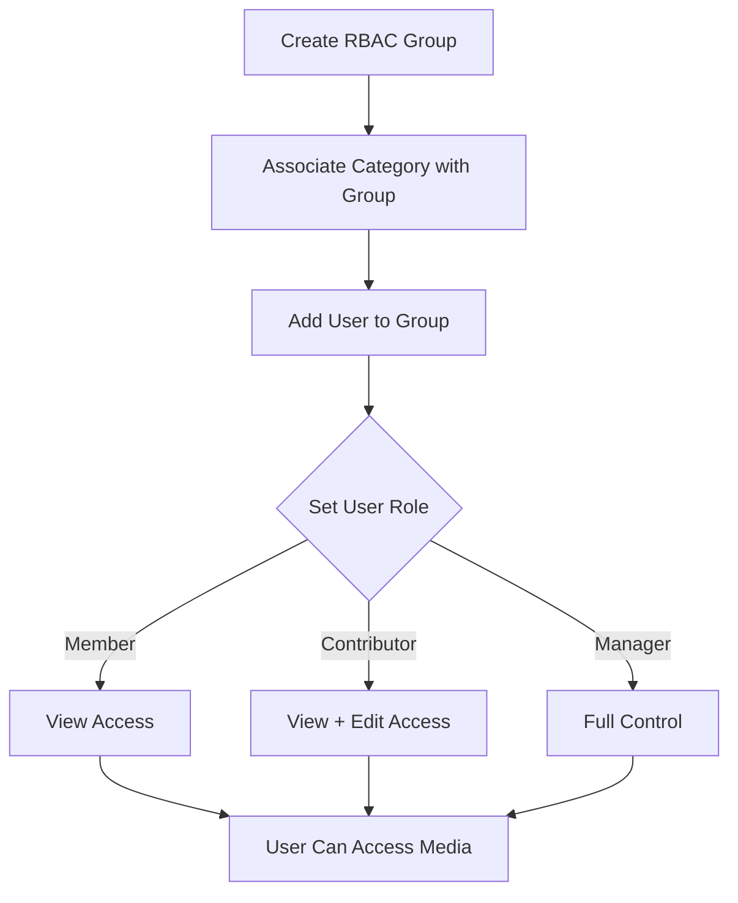

# Role-Based Access Control (RBAC)

Configure Role-Based Access Control for fine-grained media permissions.

## Overview

RBAC allows you to:
- Control media access through groups and categories
- Grant different permission levels (Member, Contributor, Manager)
- Manage team collaboration
- Restrict content to specific groups

## RBAC Workflow

## RBAC Concepts

### Groups

Groups are collections of users with shared access to categories.

### Categories

Categories organize media. When RBAC-enabled, categories can be associated with groups.

### Roles

Users have roles within groups:
- **Member**: Can view media in associated categories
- **Contributor**: Can view and edit media, publish to categories
- **Manager**: Full control over media in categories

## RBAC Workflow

### Step 1: Create a Group

1. Log in to Django admin: `/admin/`
2. Navigate to **RBAC → RBAC Groups**
3. Click **Add RBAC Group**
4. Enter group name and description
5. Save

### Step 2: Associate Category with Group

1. Navigate to **Files → Categories**
2. Edit a category
3. Select **RBAC Groups** to associate
4. Save

### Step 3: Add Users to Group

1. Navigate to **RBAC → RBAC Groups**
2. Edit your group
3. Go to **Memberships** section
4. Add users with roles:
   - **Member**: View access
   - **Contributor**: View and edit access
   - **Manager**: Full control

## Use Cases

### Private Media Access

Users can view private media if:
- Media is published to a category
- Category is associated with a group
- User is a member of that group

### Category-Based Access

Users see all media in categories they have access to:
- Visit category page
- See all media in that category
- Access controlled by group membership

### Team Collaboration

- Create groups for teams
- Associate categories with teams
- Contributors can publish to team categories
- Managers have full control

## Permission Levels

### Member

- View media in associated categories
- Access private media in categories
- See category listings

### Contributor

- All Member permissions
- Edit media in categories
- Publish media to categories
- Add media to categories

### Manager

- All Contributor permissions
- Full control over media
- Manage category associations

## Media States with RBAC

### Public Media

- Visible to everyone
- RBAC doesn't restrict access
- Still appears in category listings for group members

### Private Media

- Only visible to:
  - Owner
  - Users with direct permissions
  - Group members (if published to RBAC category)

### Unlisted Media

- Accessible via direct link
- RBAC applies same as private media

## Integration with SAML

RBAC works with SAML authentication:

1. Configure SAML identity provider
2. Set up group mapping in identity provider
3. Users automatically added to groups on login
4. Groups removed if removed from identity provider (if configured)

## Best Practices

1. **Plan Groups**: Design group structure before implementation
2. **Use Categories**: Organize media with categories
3. **Document Access**: Keep notes on group permissions
4. **Regular Reviews**: Review group memberships periodically
5. **Test Access**: Verify permissions work as expected

## Troubleshooting

### Users Can't Access Media

- Verify user is in correct group
- Check category is associated with group
- Verify media is published to category
- Check user role in group

### Permissions Not Working

- Ensure RBAC is enabled
- Verify group associations
- Check media category assignments
- Review user roles

See [Authentication Problems](../../../troubleshooting/authentication-problems.md) for more help.

## Next Steps

- [SAML Setup](saml-setup.md) - SAML authentication
- [Identity Providers](identity-providers.md) - Identity provider setup
- [Permissions Reference](../../reference/permissions-reference.md) - Complete permissions guide
