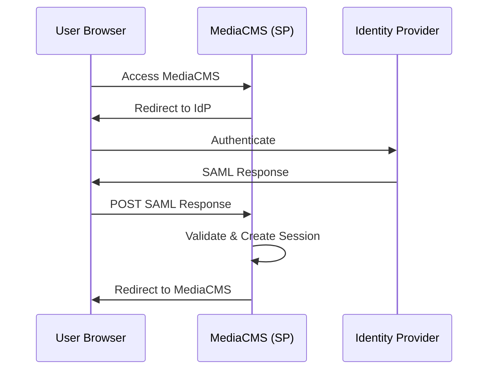

# SAML Setup

Configure SAML 2.0 authentication for MediaCMS.

## Overview

MediaCMS supports SAML 2.0 authentication, allowing integration with identity providers like:
- Microsoft Entra ID (Azure AD)
- Okta
- OneLogin
- Other SAML 2.0 compatible providers

## SAML Authentication Flow



## Prerequisites

- MediaCMS installed and accessible via HTTPS
- Administrator access to MediaCMS
- Administrator access to your identity provider
- Valid SSL certificate

## Basic SAML Configuration

### Step 1: Enable SAML

Edit `custom/local_settings.py`:

```python
USE_RBAC = True
USE_SAML = True
USE_IDENTITY_PROVIDERS = True

USE_X_FORWARDED_HOST = True
SECURE_PROXY_SSL_HEADER = ('HTTP_X_FORWARDED_PROTO', 'https')
SECURE_SSL_REDIRECT = True
CSRF_COOKIE_SECURE = True
SESSION_COOKIE_SECURE = True

SOCIALACCOUNT_ADAPTER = 'saml_auth.adapter.SAMLAccountAdapter'
SOCIALACCOUNT_PROVIDERS = {
    "saml": {
        "provider_class": "saml_auth.custom.provider.CustomSAMLProvider",
    }
}
```

### Step 2: Restart Services

**Docker Installation**:

```bash
make restart api celery_short celery_long celery_beat
```

**Single Server Installation**:

```bash
sudo systemctl restart mediacms celery_long celery_short celery_beat
```

### Step 3: Configure Identity Provider

1. Log in to MediaCMS admin panel
2. Navigate to **Identity Providers → ID Providers**
3. Click **Add ID Provider**

Configure:
- **Protocol**: `saml`
- **Provider ID**: Your identity provider identifier (usually a URL)
- **IDP Config Name**: Descriptive name
- **Client ID**: Unique identifier for this SAML integration
- **Site**: Select your site

### Step 4: Configure SAML Settings

In the **SAML Configuration** tab:

- **SSO URL**: Single Sign-On URL from your identity provider
- **SLO URL**: Single Logout URL from your identity provider
- **SP Metadata URL**: `https://your-mediacms.com/saml/metadata/`
- **IdP ID**: Identity provider identifier (usually a URL)
- **IdP Certificate**: x509 certificate from your identity provider

### Step 5: Configure Attribute Mapping

Map identity provider attributes to MediaCMS fields:

- **Uid**: User identifier
- **Name**: Display name
- **Email**: Email address
- **Groups**: Group membership (optional)
- **Role**: User role (optional)

### Step 6: Configure Role Mapping

Set up role mappings:
- **Global Role Mapping**: Map SAML roles to MediaCMS roles
- **Group Role Mapping**: Map SAML groups to RBAC groups

### Step 7: Add Login Option

1. Navigate to **Identity Providers → Login Options**
2. Click **Add Login Option**
3. Configure:
   - **Title**: Display name (e.g., "EntraID SSO")
   - **Login URL**: `https://your-mediacms.com/accounts/saml/<client-id>/login/`
   - **Ordering**: Display order
   - **Active**: Check to enable

## Microsoft Entra ID Setup

For detailed Microsoft Entra ID (Azure AD) setup, see:
- [Entra ID Setup Guide](../../saml_entraid_setup.md) - Complete Entra ID configuration guide

## Troubleshooting

### Infinite Redirect Loop

If you experience redirect loops:

1. Set `LOGIN_URL` in `local_settings.py`:

```python
LOGIN_URL = "/accounts/saml/<your-client-id>/login/"
```

2. Ensure `GLOBAL_LOGIN_REQUIRED` is not conflicting
3. Verify SAML URLs are correct

### SAML Response Issues

1. Enable SAML response logging in identity provider configuration
2. Check browser network tab for SAML responses
3. Verify attribute mappings are correct
4. Check certificate validity

### Authentication Failures

1. Verify certificate is correct
2. Check SSO and SLO URLs
3. Verify SP metadata URL is accessible
4. Check identity provider logs

See [Authentication Problems](../../../troubleshooting/authentication-problems.md) for more troubleshooting help.

## Security Considerations

- Use HTTPS for all SAML communication
- Keep certificates secure and up to date
- Regularly review role mappings
- Monitor authentication logs
- Use secure cookie settings

## Next Steps

- [Identity Providers](identity-providers.md) - Identity provider details
- [RBAC](rbac.md) - Role-Based Access Control
- [Troubleshooting](../../../troubleshooting/authentication-problems.md) - Authentication issues
