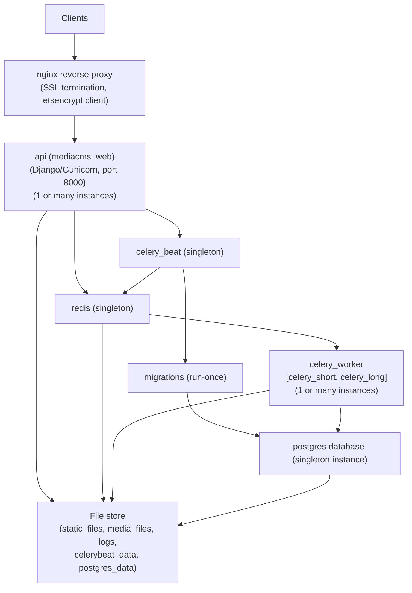
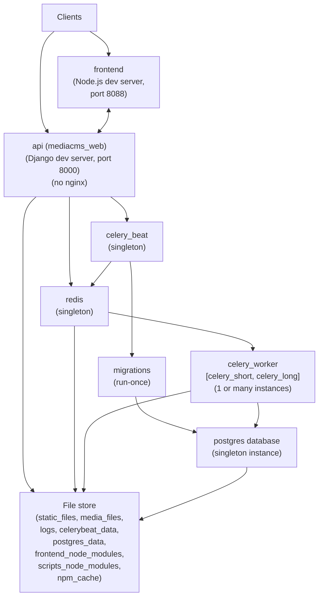
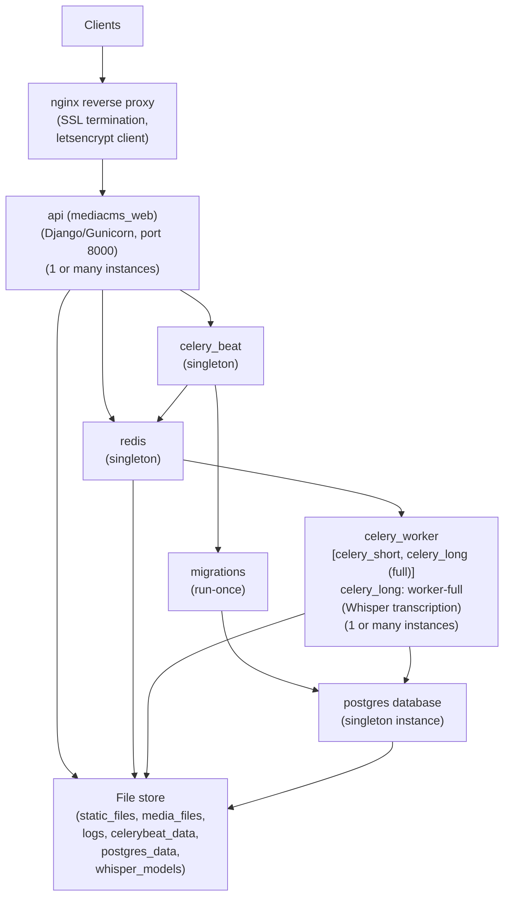

# Deployment Architecture

Understanding MediaCMS architecture helps with deployment planning, troubleshooting, and scaling.

## Architecture Overview

MediaCMS uses a microservices architecture with separate containers/services for each component, providing:

- **Scalability**: Scale individual components independently
- **Isolation**: Services run independently
- **Maintainability**: Easier to update and maintain
- **Flexibility**: Choose deployment method that fits your needs

## Production Architecture

The production deployment consists of the following services:

### Service Descriptions

#### Web Layer

- **nginx**: Reverse proxy and web server
  - Handles SSL/TLS termination
  - Serves static files
  - Proxies requests to API
  - Port: 80 (HTTP), 443 (HTTPS)

#### Application Layer

- **api**: Django application server
  - Runs Gunicorn WSGI server
  - Handles web requests
  - Serves API endpoints
  - Internal port: 8000

- **migrations**: Database migrations
  - Runs once on startup
  - Creates database schema
  - Creates admin user
  - Exits after completion

#### Task Processing

- **celery_beat**: Task scheduler
  - Schedules periodic tasks
  - Singleton (only one instance)
  - Communicates via Redis

- **celery_short**: Short-duration tasks
  - Thumbnail generation
  - Quick processing tasks
  - Can scale horizontally

- **celery_long**: Long-duration tasks
  - Video transcoding
  - HLS generation
  - Can scale horizontally

#### Data Layer

- **db (PostgreSQL)**: Database
  - Stores all application data
  - Media metadata
  - User accounts
  - Singleton (single instance)

- **redis**: Cache and message broker
  - Celery message broker
  - Application cache
  - Session storage
  - Singleton (single instance)

#### Storage

- **File Store**: Persistent volumes
  - `media_files`: Uploaded and transcoded media
  - `static_files`: CSS, JS, images
  - `postgres_data`: Database files
  - `logs`: Application logs
  - `celerybeat_data`: Celery beat schedule

## Development Architecture

Development deployment differs from production:

### Development Differences

- **No nginx**: Django dev server handles requests directly
- **Frontend dev server**: React runs on port 8088 with hot reloading
- **Debug mode**: Django runs in debug mode
- **Hot reloading**: Code changes reload automatically

## Full Deployment Architecture (with Whisper)

Full deployment includes Whisper transcription:

### Full Deployment Differences

- **worker-full**: `celery_long` uses worker-full image
- **Whisper models**: Additional storage for AI models
- **Higher resources**: More CPU and memory required

## Data Flow

### Media Upload Flow

1. User uploads media via web interface
2. nginx receives request
3. API processes upload, stores file
4. API creates Encode tasks in database
5. Celery workers pick up tasks
6. Workers transcode media
7. Workers store transcoded files
8. API updates media status

### Media Playback Flow

1. User requests media page
2. nginx receives request
3. API retrieves media metadata
4. API serves media page with player
5. Player requests media files
6. nginx serves media files (or proxies to storage)

### Authentication Flow

1. User attempts login
2. nginx receives request
3. API validates credentials
4. API creates session
5. Session stored in Redis
6. User redirected to dashboard

## Scaling Considerations

### Horizontal Scaling

**API Layer**:
- Run multiple API instances
- Load balance via nginx
- Share session storage (Redis)

**Workers**:
- Add more celery_short workers for thumbnails
- Add more celery_long workers for transcoding
- Workers scale independently

**Database**:
- PostgreSQL read replicas for reads
- Connection pooling
- Consider managed database services

### Vertical Scaling

- Increase CPU for transcoding
- Increase RAM for larger workloads
- Increase disk for media storage
- Use faster storage (SSD) for database

### Storage Scaling

- Use network storage (NFS, EFS) for shared access
- Separate media storage from application
- Consider object storage (S3) for large deployments
- Implement CDN for media delivery

## Network Architecture

### Ports

- **80/443**: HTTP/HTTPS (nginx)
- **8000**: Django API (internal)
- **5432**: PostgreSQL (internal)
- **6379**: Redis (internal)

### Internal Communication

- Services communicate via Docker network
- No external exposure needed for internal services
- Use service names for DNS resolution

## Security Considerations

### Network Security

- Only expose nginx ports externally
- Keep internal services on private network
- Use firewall rules
- Implement rate limiting

### Data Security

- Encrypt data at rest
- Use SSL/TLS for data in transit
- Secure database access
- Regular backups

### Application Security

- Keep dependencies updated
- Use secure configuration
- Implement authentication/authorization
- Monitor for vulnerabilities

## Monitoring Points

### Service Health

- API response times
- Worker queue length
- Database connections
- Redis memory usage

### Resource Usage

- CPU usage per service
- Memory usage per service
- Disk I/O
- Network bandwidth

### Application Metrics

- Request rates
- Error rates
- Transcoding success rates
- User activity

## Next Steps

- [Docker Standard Installation](docker-standard.md) - Deploy standard installation
- [Docker Full Installation](docker-full.md) - Deploy with Whisper
- [Configuration Guide](../configuration/README.md) - Configure your deployment
- [Scaling Guide](../maintenance/scaling.md) - Scale your deployment
