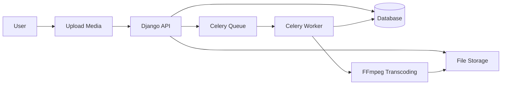
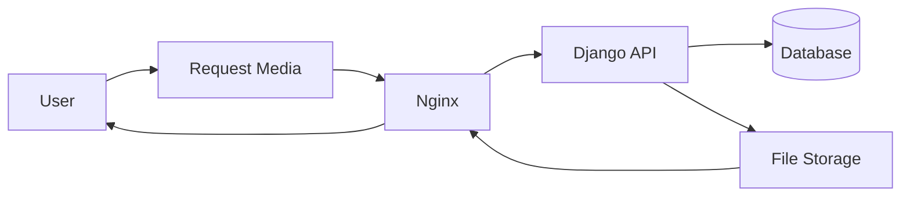

# System Architecture Overview

High-level overview of MediaCMS architecture.

## Architecture Components

MediaCMS is built using:

- **Backend**: Django (Python web framework)
- **Frontend**: React (JavaScript library)
- **Database**: PostgreSQL
- **Cache/Message Broker**: Redis
- **Task Queue**: Celery
- **Video Processing**: FFmpeg
- **Web Server**: Nginx (production)

## System Layers

### Presentation Layer

- **React Components**: User interface components
- **Django Templates**: Server-rendered pages
- **Static Files**: CSS, JavaScript, images

### Application Layer

- **Django Views**: Request handling
- **Django REST Framework**: API endpoints
- **Business Logic**: Application logic in models and views

### Data Layer

- **PostgreSQL**: Primary database
- **Redis**: Cache and message broker
- **File Storage**: Media files and static files

### Processing Layer

- **Celery Workers**: Background task processing
- **FFmpeg**: Video transcoding
- **ImageMagick**: Image processing

## Key Applications

### files/

Main Django app for media management:
- Media models and views
- Transcoding logic
- Media processing
- API endpoints

### users/

User management:
- User models
- Authentication
- Profiles
- Permissions

### rbac/

Role-Based Access Control:
- Group management
- Permission checking
- Category associations

### saml_auth/

SAML authentication:
- SAML integration
- Identity provider support
- SSO functionality

## Data Flow

### Media Upload Flow

### Media Playback Flow

## API Architecture

### REST API

MediaCMS provides a REST API using Django REST Framework:

- **Endpoints**: `/api/v1/`
- **Authentication**: Session, Token, Basic Auth
- **Documentation**: Swagger UI at `/swagger/`

### API Structure

- `/api/v1/media/` - Media management
- `/api/v1/users/` - User management
- `/api/v1/categories/` - Category management
- `/api/v1/playlists/` - Playlist management

## Task Processing

### Celery Tasks

- **Short Tasks**: Thumbnail generation, quick processing
- **Long Tasks**: Video transcoding, HLS generation

### Task Flow

1. Task created in database
2. Task queued in Redis
3. Worker picks up task
4. Worker processes task
5. Result stored in database
6. Status updated

## Security

### Authentication

- Local authentication (username/password)
- SAML authentication (SSO)
- Token authentication (API)

### Authorization

- Role-Based Access Control (RBAC)
- Media permissions
- User roles

### Data Protection

- HTTPS/SSL
- Secure cookies
- CSRF protection
- SQL injection prevention

## Scalability

### Horizontal Scaling

- Multiple API instances
- Multiple Celery workers
- Load balancing
- Database read replicas

### Vertical Scaling

- More CPU for transcoding
- More RAM for processing
- Faster storage
- Optimized configuration

## Next Steps

- [API Reference](api-reference.md) - API documentation
- [Database Schema](database-schema.md) - Database structure
- [Transcoding](../transcoding/README.md) - Transcoding details
