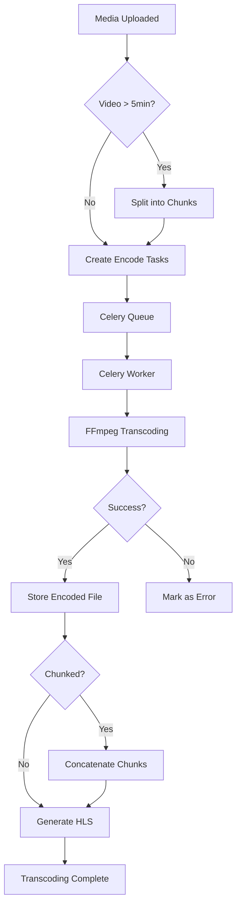

# Transcoding System

Overview of MediaCMS transcoding system.

## Overview

MediaCMS uses FFmpeg to transcode videos into multiple resolutions and formats for optimal playback.

## Transcoding Process

### Step 1: Upload

Media file uploaded and stored as original.

### Step 2: Chunking (Long Videos)

Videos longer than `CHUNKIZE_VIDEO_DURATION` are split into chunks:
- Each chunk encoded independently
- Allows parallel processing
- Faster overall transcoding

### Step 3: Encoding

For each encoding profile:
- Worker picks up encoding task
- FFmpeg transcodes to target resolution/codec
- Encoded file stored
- Status updated to 'success'

### Step 4: Concatenation (Chunked Videos)

For chunked videos:
- All chunks for a resolution concatenated
- Final file stored as Encode object
- Available for download/streaming

### Step 5: HLS Generation

After encoding completes:
- HLS version generated
- Video split into .ts segments
- .m3u8 playlist created
- Enables adaptive streaming

## Transcoding Flow



## Configuration

### FFmpeg Preset

```python
FFMPEG_DEFAULT_PRESET = "medium"  # Options: ultrafast to veryslow
```

### Chunking Settings

```python
CHUNKIZE_VIDEO_DURATION = 60 * 5  # Chunk videos > 5 minutes
VIDEO_CHUNKS_DURATION = 60 * 4    # 4 minute chunks
```

### Encoding Profiles

Manage via Django admin (`/admin/files/encodeprofile/`):
- Enable/disable profiles
- Set resolutions
- Configure codecs
- Set bitrates

## Technical Details

See [Technical Details](technical-details.md) for implementation specifics.

## Troubleshooting

See [Transcoding Issues](../../../troubleshooting/transcoding-issues.md) for common problems.

## Next Steps

- [Technical Details](technical-details.md) - Implementation details
- [Configuration](../../administration/configuration/media-settings.md) - Configuration options
- [Troubleshooting](../../../troubleshooting/transcoding-issues.md) - Problem solving
