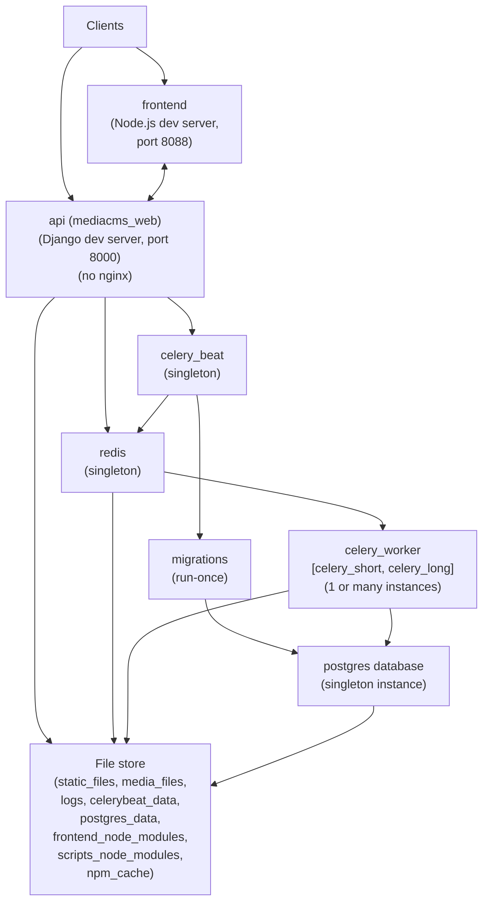

# Development Deployment Architecture

```mermaid
flowchart TD
    Clients["Clients"]
    
    API["api (mediacms_web)<br/>(Django dev server, port 8000)<br/>(no nginx)"]
    Frontend["frontend<br/>(Node.js dev server,<br/>port 8088)"]
    
    CeleryBeat["celery_beat<br/>(singleton)"]
    Redis["redis<br/>(singleton)"]
    
    Migrations["migrations<br/>(run-once)"]
    CeleryWorker["celery_worker<br/>[celery_short, celery_long]<br/>(1 or many instances)"]
    
    Postgres["postgres database<br/>(singleton instance)"]
    
    FileStore["File store<br/>(static_files, media_files,<br/>logs, celerybeat_data,<br/>postgres_data,<br/>frontend_node_modules,<br/>scripts_node_modules,<br/>npm_cache)"]
    
    Clients --> API
    Clients --> Frontend
    Frontend <--> API
    API --> CeleryBeat
    API --> Redis
    CeleryBeat --> Redis
    CeleryBeat --> Migrations
    Redis --> CeleryWorker
    Migrations --> Postgres
    CeleryWorker --> Postgres
    API --> FileStore
    Redis --> FileStore
    CeleryWorker --> FileStore
    Postgres --> FileStore
```
