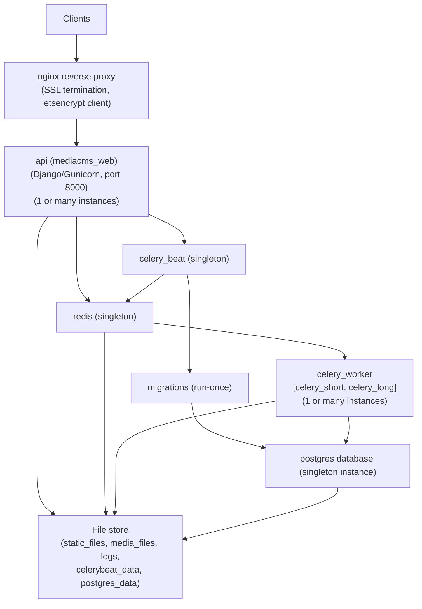

# Production Deployment Architecture

```mermaid
flowchart TD
    Clients["Clients"]
    
    Nginx["nginx reverse proxy<br/>(SSL termination, letsencrypt client)"]
    
    API["api (mediacms_web)<br/>(Django/Gunicorn, port 8000)<br/>(1 or many instances)"]
    
    CeleryBeat["celery_beat (singleton)"]
    Redis["redis (singleton)"]
    
    Migrations["migrations (run-once)"]
    CeleryWorker["celery_worker<br/>[celery_short, celery_long]<br/>(1 or many instances)"]
    
    Postgres["postgres database (singleton instance)"]
    
    FileStore["File store<br/>(static_files, media_files, logs,<br/>celerybeat_data, postgres_data)"]
    
    Clients --> Nginx
    Nginx --> API
    API --> CeleryBeat
    API --> Redis
    CeleryBeat --> Redis
    CeleryBeat --> Migrations
    Redis --> CeleryWorker
    Migrations --> Postgres
    CeleryWorker --> Postgres
    API --> FileStore
    Redis --> FileStore
    CeleryWorker --> FileStore
    Postgres --> FileStore
```
