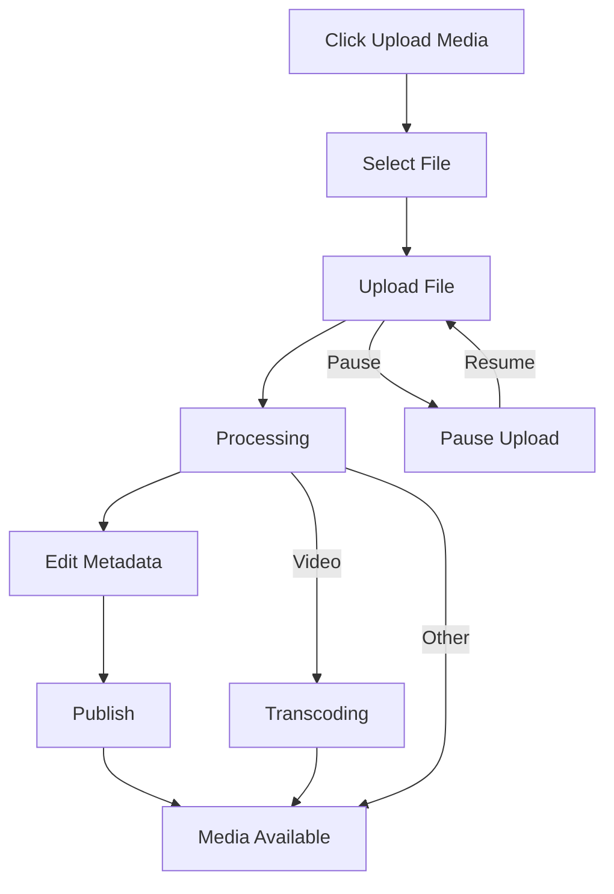

# Uploading Media

Learn how to upload videos, audio, images, and PDFs to MediaCMS.

## Quick Start

Uploading media is simple:

1. Click the **Upload Media** button
2. Select your file (or drag and drop)
3. Wait for upload to complete
4. Add metadata and publish

## Upload Workflow



## Step-by-Step Guide

### Step 1: Click Upload Button

Click the **Upload Media** button from the right-side of the screen at the top:


### Step 2: Navigate to Upload Page

Clicking the **Upload Media** button takes you to the upload page at a URL like:

```
https://your-mediacms-instance.com/upload
```

### Step 3: Select Your File

You have two options:

**Option A: Browse Files**
- Click the **"Browse your files"** button
- Select the media file from your computer
- Click **Open**


**Option B: Drag and Drop**
- Drag a file from your desktop
- Drop it onto the upload area


### Step 4: Wait for Upload

The file will upload automatically. You'll see a progress indicator:


**Pause Upload**: Click the **Pause** button if you need to pause:


**Resume Upload**: Click **Continue** to resume:


### Step 5: Wait for Processing

After upload, MediaCMS will process your file:


For videos, this includes:
- Transcoding to multiple resolutions
- Generating thumbnails
- Creating preview sprites

**Note**: Processing can take time depending on file size and server capacity.

### Step 6: View Your Media

Click **View Media** to see your uploaded file:


### Step 7: Add Metadata

Click **Edit Media** to add information:


Fill in:
- **Title** (required)
- **Description**
- **Category**
- **Tags**
- **Visibility** (Public, Unlisted, Private)


## Supported File Types

MediaCMS supports:
- **Videos**: MP4, MOV, AVI, MKV, and more
- **Audio**: MP3, WAV, OGG, FLAC
- **Images**: JPG, PNG, GIF, WebP
- **Documents**: PDF

## Upload Limits

- **Maximum file size**: Configurable by administrator (default: 4GB)
- **Maximum files per upload**: Configurable (default: 100)
- **User upload limit**: Configurable per user (default: 100 media items)

## Tips

1. **Use descriptive titles**: Help others find your content
2. **Add tags**: Improve discoverability
3. **Choose appropriate categories**: Organize your content
4. **Set visibility**: Control who can see your media
5. **Wait for processing**: Videos need time to transcode

## Troubleshooting

### Upload Fails

- Check file size limits
- Verify file format is supported
- Check your internet connection
- Contact administrator if issues persist

### Processing Stuck

- Processing can take time for large videos
- Check with administrator if processing takes unusually long
- Verify transcoding workers are running

## Next Steps

- [Managing Media](managing-media.md) - Edit and organize your content
- [Subtitles & Captions](subtitles-captions.md) - Add accessibility features
- [Video Editing](video-editing.md) - Trim and edit videos
